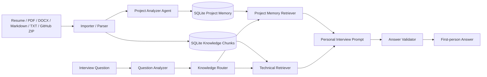

# Personal Engineering Memory

## 目标

将原来的 Document RAG 升级为以候选人真实项目经验为第一优先级的 Personal Engineering Memory System。原有 Resume/JD、Knowledge Base、Embedding Provider、Interview History 和文档分块检索继续保留。

## 数据流

## 新增模块

- `packages/shared/src/knowledge/importer.ts`：导入来源分类、代码语言识别和源码摘要。
- `packages/shared/src/knowledge/analyzer.ts`：Project Analyzer Agent 和 C/C++、Python、TypeScript、Rust 的轻量源码分析。
- `packages/shared/src/knowledge/project-memory.ts`：项目、模块、技术点、问题和面试问题的确定性抽取与 LLM JSON 合并。
- `packages/shared/src/knowledge/retriever.ts`：Question Analyzer、项目记忆检索和知识路由。
- `packages/shared/src/knowledge/answer-validator.ts`：第一人称、AI 风格、技术事实和项目回答结构校验。
- `packages/shared/src/knowledge/knowledge-graph.ts`：项目到模块、技术点、问题和面试问题的图关系。

## 面试回答优先级

1. 当前 Profile 对应的 Project Memory。
2. Profile Builder 的真实经历素材和 Resume 片段。
3. 题库中已验证的回答卡。
4. 关联 Knowledge Base 的混合检索结果。
5. 没有个人证据时才回答通用技术内容，并明确不把方案说成候选人做过。

项目题会要求背景、个人职责、具体实现、问题原因、解决方案和结果；回答中的芯片、协议、模块和功能会和个人证据做确定性校验。

## 数据库

数据库仍为本地 sql.js SQLite。迁移 009 为 `projects` 补充项目画像字段，并新增 `project_modules`、`technical_points`、`project_problems`、`interview_questions`。迁移 010 在兼容这些旧表的基础上，将项目问题同步到统一题库作用域，并新增 `project_facts`、`project_fact_sources`、`job_targets`、`job_requirements`、`knowledge_analysis_runs`、`retrieval_runs` 和 `retrieval_hits`。对应脚本见 [`migrations/009_project_memory.sql`](migrations/009_project_memory.sql) 和 [`migrations/010_knowledge_model.sql`](migrations/010_knowledge_model.sql)，Electron 启动时会自动执行同等迁移。

简历、岗位要求和项目文档属于上下文/证据；通用题、项目题和答案卡属于可检索的准备材料；面试问题、检索命中和最终回答属于运行时数据。项目回答只能使用已关联的项目事实，岗位要求只用于调整回答重点，不能作为候选人经历的证据。

## 使用方式

在当前 Profile 上传 Resume 或把项目资料/GitHub 仓库 ZIP 导入知识库后，系统会在后台生成项目记忆。个人知识页面展示项目、模块、技术点、问题和自动生成的面试问题；面试时自动使用当前 Profile 的项目记忆。
